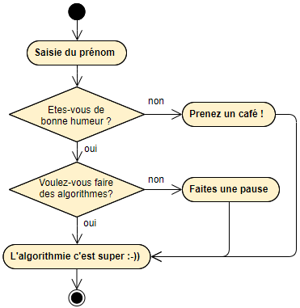

# ALGORITHME : EXOS TESTS

## Exo 1

Ecrire un algorithme qui demande un nombre à l’utilisateur, et l’informe ensuite si ce nombre est positif ou négatif (on laisse de côté le cas où le nombre vaut zéro).

## Exo 2

Écrire un algorithme qui demande un nombre entre 10 et 20 à l'utilisateur et lui indique si sa saisie est correcte.

## Exo 3

Reprendre l'exercice 1 en ajoutant cette fois le cas où le nombre vaut zéro.

## Exo 4

Ecrire un algorithme qui demande trois noms à l’utilisateur et l’informe ensuite s’ils sont rangés ou non dans l’ordre alphabétique.

## Exo 5

Ecrire un algorithme qui demande deux nombres à l’utilisateur et l’informe ensuite si le produit est négatif ou positif (on inclut le traitement du cas où le produit peut être nul). Attention toutefois, on ne doit pas calculer le produit !

## Exo 6

 Écrire un algorithme qui détermine la catégorie sportive d’un utilisateur en fonction de son âge :

    - 18 à 19 ans : junior 
    - 20 à 22 ans : espoir 
    - 23 à 39 ans : sénior 
    - 40 ans et plus : vétéran

## Exo 7

Un magasin de reprographie facture 0,10 € les dix premières photocopies, 0,09 € les vingt suivantes et 0,08 € au-delà.

Ecrivez un algorithme qui demande à l’utilisateur le nombre de photocopies effectuées et qui affiche la facture correspondante.

## Exo 8

Cet algorithme est destiné à prédire l'avenir, et il doit être infaillible !
Il lira au clavier l’heure et les minutes, et il affichera l’heure qu’il sera une minute plus tard.

Par exemple, si l'utilisateur tape 21 puis 32, l'algorithme doit répondre : "Dans une minute, il sera 21 heure(s) 33".

Note : on suppose que l'utilisateur entre une heure valide. Pas besoin donc de la vérifier.

## Exo 9

Les habitants de Zorglub paient l’impôt selon les règles suivantes :

   - les hommes de plus de 20 ans paient l’impôt
   - les femmes paient l’impôt si elles ont entre 18 et 35 ans
   - les autres ne paient pas d’impôt

Le programme demandera donc l’âge et le sexe du Zorglubien, et se prononcera donc ensuite sur le fait que l’habitant est imposable.

## Exo 10

Programmez un chatbot, comme par exemple :

Testez votre algorithme sur Scratch.

 

> Corrections [2_exos_tests.md_corrections.md](2_exos_tests.md_corrections.md)